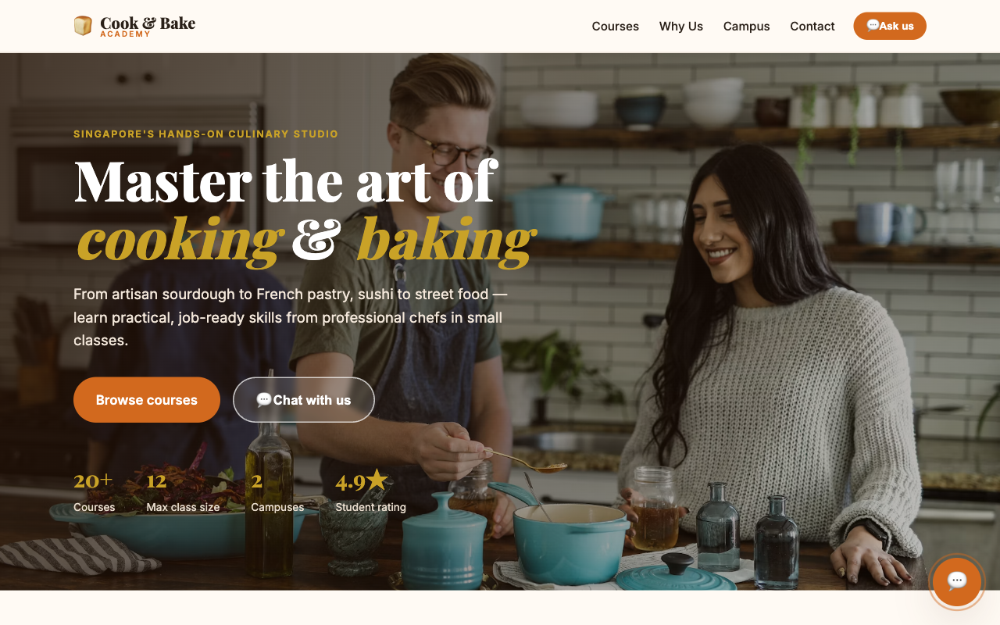

# Cook & Bake Academy - Browser Course Assistant

A Cook & Bake Academy landing page with a private, in-browser course concierge.
The assistant answers common course, fee, intake, campus, enrolment, and refund
questions without sending messages to an AI service or incurring usage charges.

## Live Demo

🔗 **https://alfredang.github.io/copilot-bakery/**

## What's inside

| Path | Description |
|------|-------------|
| [`website/`](website/) | One-page landing site and branded browser-based FAQ/course assistant. Images from Unsplash. |
| [`brochures/`](brochures/) | Source information for 20 mock courses: 10 bakery and 10 cooking. |
| [`skills/`](skills/) | Optional legacy skill packages created for the earlier Copilot Studio demo. |
| [`api/`](api/) | Optional legacy Direct Line token service; the browser assistant does not call it. |

## Quick start

1. Open [`website/index.html`](website/index.html) in a browser, or serve the
   `website` folder with any static web server.

2. Select one of the suggested questions or type a course title, course code,
   budget, level, campus, enrolment, or refund question.

3. Update the `COURSES`, `COURSE_DETAILS`, campus, and refund rules in
   [`website/script.js`](website/script.js) when the mock catalogue changes.

## How it works

The assistant uses deterministic intent matching and the published mock course
catalogue in `script.js`. All processing happens inside the visitor's browser.
There is no Copilot Studio, Direct Line, Azure Function, API key, sign-in, or
per-message charge in the active website flow.
